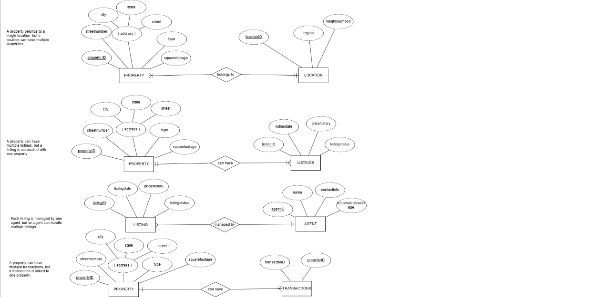
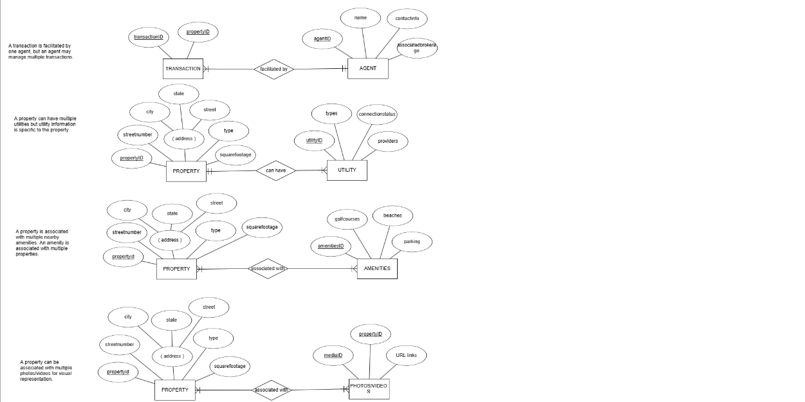
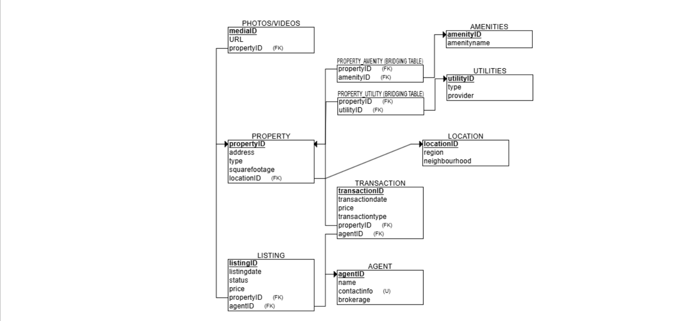

# REAL ESTATE DATABASE

## Problem Statement and ER Diagram

This project models a real estate listing and sales system, allowing agents to manage property listings, transactions, and client information.

## Entity Relationship Model 
Because the full diagram did not fit in one image, it's split into two parts:
- 
- 

---

## Relational Model

The following relational schema was derived from the ER model:

- 

---

## Source Code

- [`Create.sql`](./create.sql): Contains the SQL DDL statements to create the tables.
- [`Populate.sql`](./populate.sql): Populates the database with sample data.

---

## Sample Queries for Milestone 3

This section outlines example queries and their purposes, based on the data model and queries from **Milestone 3**. The corresponding SQL queries are saved as `milestone_3_queries.sql`.

---

### **Query 1**
**What are the active listings and who are the agents responsible for them?**
```sql
SELECT
    l.ListingID,
    a.FirstName + ' ' + a.LastName AS AgentName,
    p.Address,
    l.ListingPrice,
    l.Status
FROM Listing l
JOIN Agent a ON l.AgentID = a.AgentID
JOIN Property p ON l.PropertyID = p.PropertyID
WHERE l.Status = 'Active';
```

---

### **Query 2**
**How many listings does each agent manage?**
```sql
SELECT
    a.FirstName + ' ' + a.LastName AS AgentName,
    COUNT(l.ListingID) AS TotalListings
FROM Agent a
LEFT JOIN Listing l ON a.AgentID = l.AgentID
GROUP BY a.FirstName, a.LastName;
```

---

### **Query 3**
**What is the price per square foot of each active property listing?**
```sql
SELECT
    p.Address,
    l.ListingPrice,
    p.SquareFeet,
    (l.ListingPrice / p.SquareFeet) AS PricePerSqFt
FROM Listing l
JOIN Property p ON l.PropertyID = p.PropertyID
WHERE l.Status = 'Active';
```

---

### **Query 4**
**What amenities are available at each property?**
```sql
SELECT
    p.Address,
    a.AmenityName
FROM Property p
JOIN Property_Amenity pa ON p.PropertyID = pa.PropertyID
JOIN Amenities a ON pa.AmenityID = a.AmenityID;
```

---

### **Query 5**
**What is the total sales value handled by each agent?**
```sql
SELECT
    ag.FirstName + ' ' + ag.LastName AS AgentName,
    SUM(pt.SalePrice) AS TotalSales
FROM PropertyTransaction pt
JOIN Listing l ON pt.ListingID = l.ListingID
JOIN Agent ag ON l.AgentID = ag.AgentID
GROUP BY ag.FirstName, ag.LastName;
```

---

> ✅ All queries listed above are part of the final `milestone_3_queries.sql` file and reflect the schema implemented in the x2022ehm database for BSAD 384.

